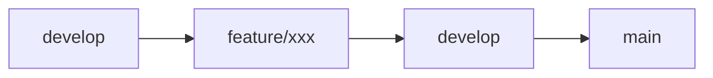
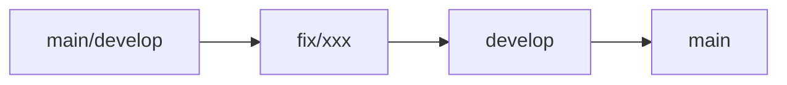
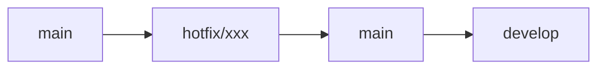

# Git 提交规范

本文档定义了 Todo Management 项目的 Git 提交规范和分支管理策略。

## 提交信息格式

### 提交信息结构

采用 Conventional Commits 规范，提交信息格式如下：

```
<type>(<scope>): <subject>

<body>

<footer>
```

### Type 类型

提交类型说明代码变更的性质：

| 类型       | 说明      | 示例             |
| ---------- | --------- | ---------------- |
| `feat`     | 新功能    | 添加任务编辑功能 |
| `fix`      | Bug 修复  | 修复任务排序错误 |
| `docs`     | 文档更新  | 更新 README      |
| `style`    | 代码格式  | 格式化代码       |
| `refactor` | 重构      | 重构组件结构     |
| `perf`     | 性能优化  | 优化列表渲染性能 |
| `test`     | 测试相关  | 添加单元测试     |
| `chore`    | 构建/工具 | 更新依赖包       |
| `revert`   | 回滚提交  | 回滚之前的提交   |

### Scope 范围

提交影响的模块或功能范围：

- `task`：任务相关
- `kanban`：看板视图
- `component`：通用组件
- `db`：数据库操作
- `auth`：认证相关
- `ui`：UI 界面
- `utils`：工具函数
- `config`：配置文件

### Subject 主题

简短描述本次提交的内容：

- 使用现在时态，如 "add" 而非 "added"
- 首字母小写
- 结尾不加句号
- 限制在 50 个字符以内

### Body 正文（可选）

详细描述本次提交的内容：

- 使用现在时态
- 说明本次提交的目的和动机
- 与上一行空一行分隔

### Footer 页脚（可选）

- 列出破坏性变更（Breaking Changes）
- 关联 Issue

## 提交信息示例

### feat 示例

```
feat(task): 添加任务拖拽排序功能

使用 @dnd-kit 实现看板任务拖拽排序，支持同列排序和跨列移动。

Closes #123
```

### fix 示例

```
fix(kanban): 修复任务跨列拖拽后状态未更新问题

拖拽任务到其他列时，未正确更新任务的状态，导致显示错误。
现已修复状态同步逻辑。
```

### docs 示例

```
docs: 更新项目部署文档

添加 CloudStudio 部署步骤说明，更新环境变量配置示例。
```

### refactor 示例

```
refactor(component): 重构 TaskCreateModal 组件

拆分 TaskCreateModal 为更小的子组件，提高代码可维护性。
- 将富文本编辑器提取为独立组件
- 将时间选择器提取为独立组件
```

### perf 示例

```
perf(kanban): 优化看板任务列表渲染性能

使用 React.memo 和 useMemo 优化任务卡片渲染，减少不必要的重渲染。
```

## 提交信息规范

### 必须遵循的规则

1. **Type 和 Scope 使用小写字母**

   ```
   ✅ feat(task): 添加功能
   ❌ Feat(Task): 添加功能
   ```

2. **Subject 使用现在时态**

   ```
   ✅ fix: 修复错误
   ❌ fix: 修复了错误
   ```

3. **Subject 不超过 50 个字符**

   ```
   ✅ fix: 修复任务排序错误
   ❌ fix: 修复看板任务跨列拖拽后排序顺序不正确的问题
   ```

4. **Subject 结尾不加句号**

   ```
   ✅ feat: 添加新功能
   ❌ feat: 添加新功能。
   ```

5. **Body 每行不超过 72 个字符**

### 推荐的最佳实践

1. **Body 中说明"为什么"而非"如何"**

   ```
   ✅ 修复用户无法保存任务的问题
   ❅ 修改 saveTask 函数，添加错误处理
   ```

2. **使用 Issue 编号关联**

   ```
   feat(task): 添加任务标签功能

   Closes #45
   ```

3. **多步骤变更使用分号**

   ```
   refactor: 重构数据层

   - 将数据库操作封装到 Repository;
   - 优化查询性能;
   - 添加数据验证。
   ```

## 分支管理策略

### 分支命名规范

#### 主分支

- `main`：主分支，始终保持稳定可部署状态

#### 开发分支

- `develop`：开发分支，集成最新开发功能

#### 功能分支

格式：`feature/<功能名称>`

示例：

- `feature/task-drag-sort`：任务拖拽排序功能
- `feature/task-reminder`：任务提醒功能
- `feature/theme-switch`：主题切换功能

#### 修复分支

格式：`fix/<问题描述>`

示例：

- `fix/task-sort-error`：修复任务排序错误
- `fix/database-sync`：修复数据库同步问题

#### 优化分支

格式：`refactor/<优化内容>`

示例：

- `refactor/component-structure`：重构组件结构
- `refactor/code-style`：代码风格重构

#### 文档分支

格式：`docs/<文档内容>`

示例：

- `docs/update-readme`：更新 README
- `docs/add-api-docs`：添加 API 文档

### 分支工作流

#### 功能开发流程



1. 从 `develop` 分支创建功能分支
2. 在功能分支上进行开发
3. 开发完成后合并回 `develop`
4. `develop` 分支稳定后合并到 `main`

#### Bug 修复流程



1. 根据问题来源从 `main` 或 `develop` 创建修复分支
2. 在修复分支上进行修复
3. 修复完成后合并回 `develop` 和 `main`

#### 紧急修复流程



1. 从 `main` 分支创建热修复分支
2. 修复完成后合并回 `main`
3. 同步合并到 `develop`

### 分支保护规则

#### Main 分支保护

- 需要至少 1 人审核
- 需要通过 CI 检查
- 禁止直接推送
- 必须使用 Pull Request

#### Develop 分支保护

- 需要通过 CI 检查
- 推荐使用 Pull Request

### 分支生命周期

#### Feature 分支

```
创建 → 开发 → 测试 → 代码审查 → 合并 → 删除
```

1. **创建**：从 `develop` 分支创建
2. **开发**：在分支上进行功能开发
3. **测试**：本地测试和功能验证
4. **代码审查**：提交 Pull Request 进行审查
5. **合并**：审查通过后合并到 `develop`
6. **删除**：合并后删除分支

## Pull Request 规范

### PR 标题格式

使用提交信息格式作为 PR 标题：

```
feat(task): 添加任务拖拽排序功能
```

### PR 描述模板

```markdown
## 变更类型

- [ ] 新功能 (feat)
- [ ] Bug 修复 (fix)
- [ ] 文档更新 (docs)
- [ ] 代码格式 (style)
- [ ] 重构 (refactor)
- [ ] 性能优化 (perf)
- [ ] 测试 (test)
- [ ] 构建/工具 (chore)

## 变更描述

简要描述本次 PR 的内容和目的

## 相关 Issue

关联相关的 Issue 编号

Closes #123

## 测试

- [ ] 已在本地测试
- [ ] 已更新相关文档
- [ ] 已通过代码审查

## 截图（如适用）

如果涉及 UI 变更，提供前后对比截图

## 检查清单

- [ ] 代码符合项目编码规范
- [ ] 提交信息符合规范
- [ ] 无 ESLint 错误
- [ ] 无 Prettier 警告
- [ ] 已更新文档（如需要）
```

### PR 审查要点

- **代码质量**：代码是否清晰、可读、可维护
- **功能完整性**：功能是否完整实现
- **测试覆盖**：是否有足够的测试用例
- **性能影响**：是否对性能产生负面影响
- **文档更新**：是否更新了相关文档
- **提交规范**：提交信息是否符合规范

## 常用 Git 命令

### 基本操作

```bash
# 克隆仓库
git clone <repository-url>

# 查看当前分支
git branch

# 切换分支
git checkout <branch-name>

# 创建并切换到新分支
git checkout -b <branch-name>

# 查看状态
git status

# 添加文件到暂存区
git add <file-name>

# 提交变更
git commit -m "feat: 添加功能"

# 推送到远程
git push origin <branch-name>
```

### 分支操作

```bash
# 创建新分支
git branch <branch-name>

# 删除本地分支
git branch -d <branch-name>

# 删除远程分支
git push origin --delete <branch-name>

# 重命名分支
git branch -m <old-name> <new-name>

# 合并分支
git merge <branch-name>

# 变基分支
git rebase <branch-name>
```

### 提交操作

```bash
# 修改最后一次提交信息
git commit --amend

# 修改最后一次提交内容
git add <file-name>
git commit --amend --no-edit

# 撤销暂存
git reset HEAD <file-name>

# 撤销工作区变更
git checkout -- <file-name>

# 查看提交历史
git log

# 查看提交历史（单行）
git log --oneline
```

### 标签操作

```bash
# 创建标签
git tag <tag-name>

# 创建带注释的标签
git tag -a <tag-name> -m "版本说明"

# 推送标签到远程
git push origin <tag-name>

# 推送所有标签
git push origin --tags

# 查看标签
git tag
```

### 暂存和恢复

```bash
# 暂存当前工作
git stash

# 暂存并添加说明
git stash save "工作说明"

# 查看暂存列表
git stash list

# 恢复暂存
git stash pop

# 恢复指定暂存
git stash pop stash@{n}

# 删除暂存
git stash drop
```

## 提交规范检查工具

### Commitlint

使用 Commitlint 检查提交信息是否符合规范。

#### 安装

```bash
pnpm add -D @commitlint/cli @commitlint/config-conventional
```

#### 配置

创建 `commitlint.config.js`：

```javascript
export default {
  extends: ['@commitlint/config-conventional'],
  rules: {
    'type-enum': [
      2,
      'always',
      [
        'feat',
        'fix',
        'docs',
        'style',
        'refactor',
        'perf',
        'test',
        'chore',
        'revert',
      ],
    ],
    'subject-case': [0],
  },
}
```

### Husky

使用 Husky 在提交前自动检查。

#### 安装

```bash
pnpm add -D husky
pnpm pkg set scripts.prepare="husky install"
pnpm run prepare
```

#### 配置

```bash
pnpm husky add .husky/commit-msg 'npx --no -- commitlint --edit $1'
```

### Git Hooks

#### Commit Message Hook

在 `.husky/commit-msg` 中：

```bash
#!/bin/sh
. "$(dirname "$0")/_/husky.sh"

npx --no -- commitlint --edit $1
```

#### Pre-commit Hook

在 `.husky/pre-commit` 中：

```bash
#!/bin/sh
. "$(dirname "$0")/_/husky.sh"

pnpm run lint:format
```

## 版本管理

### 语义化版本

遵循语义化版本规范（Semantic Versioning）：`MAJOR.MINOR.PATCH`

- **MAJOR**：不兼容的 API 修改
- **MINOR**：向下兼容的功能性新增
- **PATCH**：向下兼容的问题修正

示例：

- `1.0.0`：初始版本
- `1.1.0`：添加新功能
- `1.1.1`：修复 Bug
- `2.0.0`：重大更新，不兼容旧版本

### 版本标签

为每个发布版本创建标签：

```bash
# 创建标签
git tag -a v1.0.0 -m "发布 v1.0.0"

# 推送标签
git push origin v1.0.0

# 推送所有标签
git push origin --tags
```

### 发布流程

1. 更新版本号
2. 创建发布分支
3. 更新 CHANGELOG
4. 合并到 main
5. 创建标签
6. 发布到生产环境

## 最佳实践

### 1. 频繁提交

保持提交的小而频繁，每个提交完成单一功能。

```
✅ 好的实践
feat: 添加任务创建功能
fix: 修复任务保存错误
docs: 更新 README

❌ 不好的实践
feat: 添加任务创建、编辑、删除功能，修复多个 bug，更新文档
```

### 2. 提交前检查

在提交前运行检查命令：

```bash
pnpm run lint
pnpm run format
pnpm run test
```

### 3. 使用分支

不要直接在 main 或 develop 分支上开发，使用功能分支。

### 4. 代码审查

所有合并到 main 和 develop 的代码必须经过审查。

### 5. 保持历史清晰

使用 `rebase` 保持提交历史的线性，避免不必要的合并提交。

### 6. 及时同步

定期从远程拉取最新代码，保持本地分支最新。

```bash
git fetch origin
git rebase origin/main
```

### 7. 合理使用 `--force`

谨慎使用强制推送，仅在必要时使用。

```bash
git push origin feature/xxx --force
```

## 常见问题

### 如何修改历史提交？

```bash
# 修改最近的 N 次提交
git rebase -i HEAD~N

# 在编辑器中将要修改的提交从 pick 改为 edit
# 修改完成后
git add .
git rebase --continue
```

### 如何撤销错误的合并？

```bash
# 找到合并前的 commit hash
git log

# 撤销合并
git revert -m 1 <merge-commit-hash>
```

### 如何解决冲突？

```bash
# 1. 标记冲突文件
git status

# 2. 手动解决冲突

# 3. 标记冲突已解决
git add <conflicted-file>

# 4. 继续合并或变基
git merge --continue
# 或
git rebase --continue
```

### 如何查看某次提交的变更？

```bash
# 查看提交详情
git show <commit-hash>

# 查看文件变更
git show <commit-hash> -- <file-name>

# 查看变更统计
git show <commit-hash> --stat
```

## 总结

遵循以上 Git 规范，可以确保：

- **历史清晰**：提交历史易于理解
- **协作顺畅**：团队成员协作更加高效
- **版本管理**：版本发布更加规范
- **代码质量**：代码审查更加有效
- **问题追踪**：问题定位和修复更加便捷
